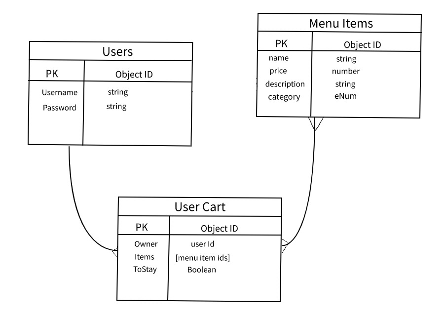

# Project-2

   My plan is to create web app CoffeeShop. There i am going to have a menu, some information about
 coffeeShop, contactUS and user model, which is going to be able to sign up, log in/out, and where account holders can have some more options such as, order some products online, and get some extra discounts and bonuses.

User Stories: 
- create an account 
- log in
- log out
- Check through menu
- add menu items to cart
- update cart
- remove from cart

Stretch goal: 
- apply discounts
- menu item quantity(changes when added or removed from cart)

Some very Basic plan:

Here is ERD(Entity Relationship Diagram):

My work plan for the week:
- day 1-4 work on functionality of BackEnd codes , JS, Node, Express, Mongoose
- day 4-6 work on liquid js, bootstrap, FrontEnd connecting with BackEnd
- day 6-7 styling using CSS, some bootstrap